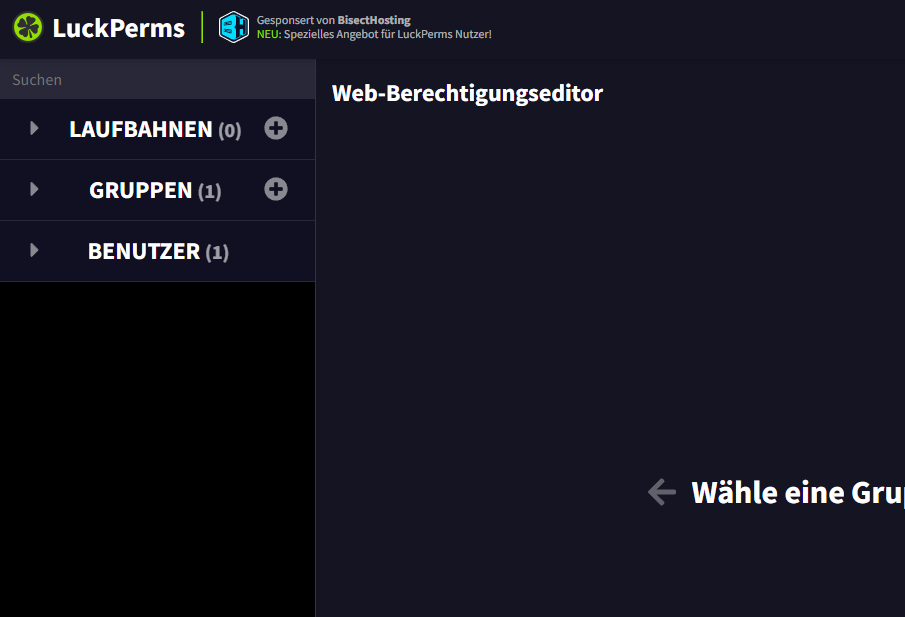
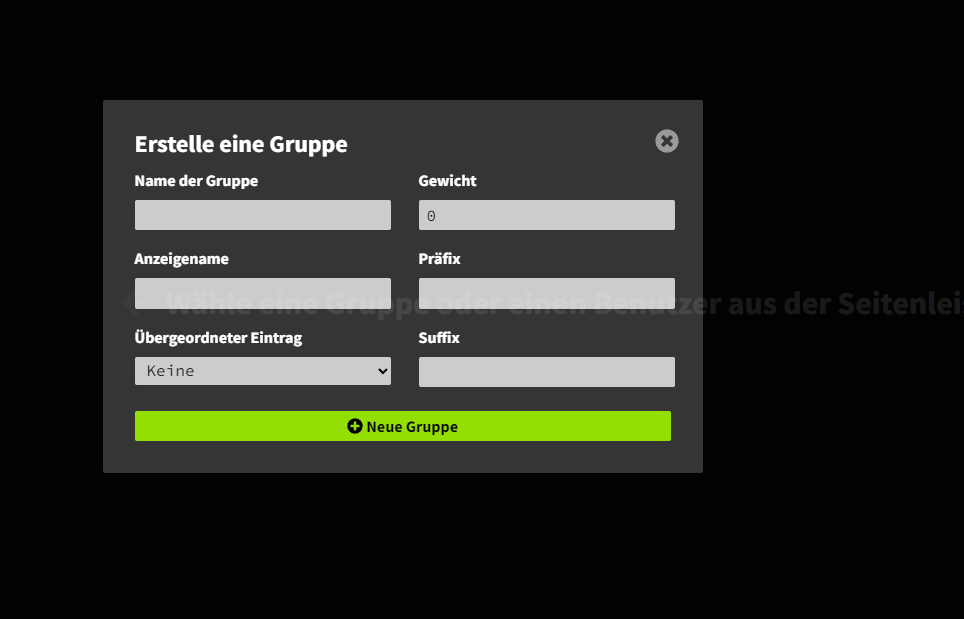
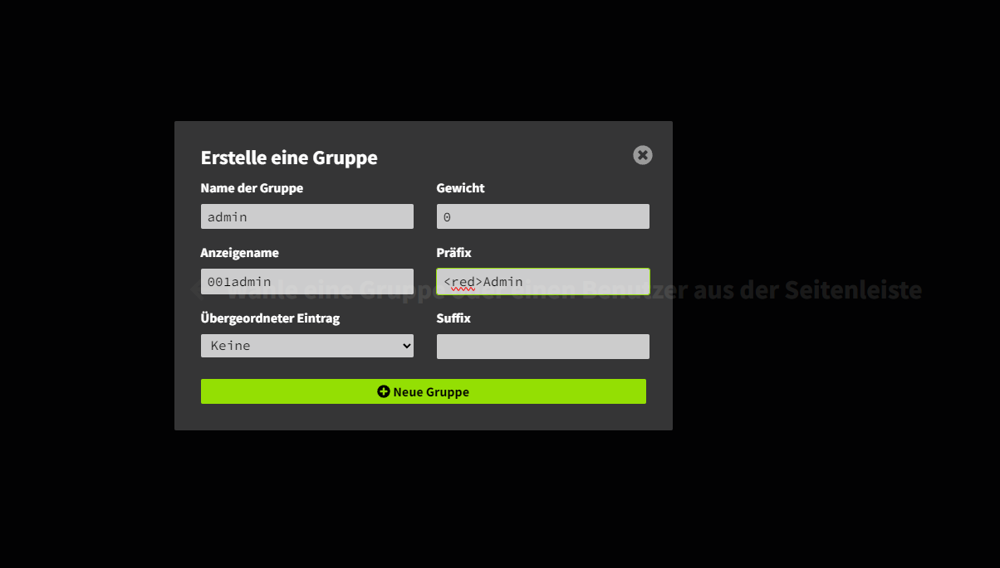
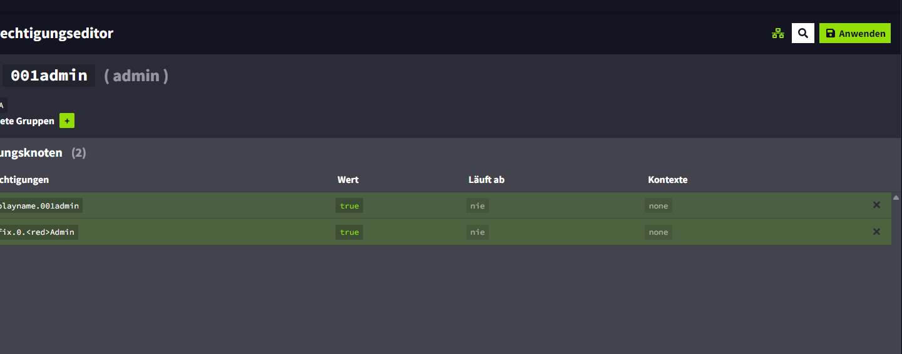

# Setup LuckPerms Groups for LuckUtils

# Do /lp editor in the chat

# Open the Link (click)

# go to Groups/Gruppen and press the plus (+)

# Next fill in the informations, i do it for an "admin" group
# Anzeigename/Displayname must have a number before the name (for sorting the tablist)
# Prefix can contains gradients, hexcolors.... (see Kyori Adventure API)
# Warning every gap except "suffix" have to be filled in.

# Press Neue Gruppe/Create Group

# Press Anwenden/Apply

# Ingame you got a message with the changes.
# Do that for every group you want

